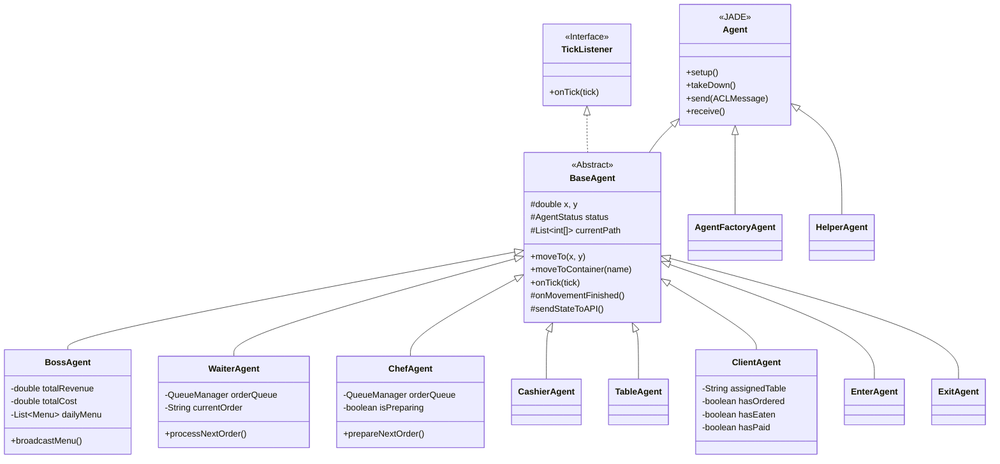

# 🍽️ Restaurant Multi-Agent System (REST_MAS)

A comprehensive **JADE-based Multi-Agent System** simulating a restaurant environment where autonomous agents interact, communicate, and coordinate to serve customers.

---

## 📚 Table of Contents
- [System Overview](#-system-overview)
- [Architecture](#-architecture)
- [Class Hierarchy](#-class-hierarchy)
- [Agent Status System](#-agent-status-system)
- [Agent Roles](#-agent-roles)
- [Agent Type Classification (BDI Model)](#-agent-type-classification-bdi-model)
- [Pipeline Scenario: Complete Flow](#-pipeline-scenario-complete-flow-start--end)
- [Container Structure](#-container-structure)
- [Customer Journey](#-customer-journey)
- [Message Flow](#-message-flow)
- [State Diagrams](#-state-diagrams)
- [Tick System](#-tick-system)
- [Grid Environment & Movement System](#-grid-environment--movement-system)
- [Detailed Agent Descriptions](#-detailed-agent-descriptions)
- [Core Infrastructure Classes](#-core-infrastructure-classes)
- [Entry Points & Main Classes](#-entry-points--main-classes)
- [Web Dashboard (Flask API)](#-web-dashboard-flask-api)
- [Getting Started](#-getting-started)
- [Project Structure](#-project-structure)
- [Menu Items](#-menu-items)
- [Key Takeaways](#-key-takeaways)
- [License](#-license)

---

## 🔍 System Overview

This simulation models a restaurant with the following key features:

| Feature | Description |
|---------|-------------|
| **Agent-Based** | Each entity (client, waiter, chef, etc.) is an autonomous agent |
| **JADE Platform** | Built on Java Agent DEvelopment Framework |
| **Mobility** | Agents move between JADE containers during simulation |
| **REST API** | Flask-based web dashboard for visualization |
| **Tick-Based** | Time-sliced simulation with configurable speed |
| **A* Pathfinding** | Intelligent movement on a 120×120 grid |

---

## 🏗️ Architecture


---

## 📐 Class Hierarchy



---

## 📊 Agent Status System

All agents track their state using the `AgentStatus` enum defined in [AgentStatus.java](src/mas/core/AgentStatus.java). This provides visibility into what each agent is doing at any given time.

### Status Categories

#### Client Statuses
| Status | Description | When Used |
|--------|-------------|-----------|
| `WAITING_IN_QUEUE` | Client waiting for table assignment | At EntryContainer in queue |
| `MOVING_TO_TABLE` | Client traveling to assigned table | EnvContainer → TableContainer |
| `AT_TABLE` | Client seated at table | Arrived at TableContainer |
| `ORDERING` | Client requesting menu and placing order | Interacting with table/waiter |
| `EATING` | Client consuming food | After food delivery |
| `MOVING_TO_CASHIER` | Client traveling to cashier | TableContainer → CashierContainer |
| `PAYING` | Client processing payment | At CashierContainer |
| `MOVING_TO_EXIT` | Client traveling to exit | CashierContainer → ExitContainer |
| `EXITING` | Client at exit, about to be removed | At ExitContainer |

#### Waiter Statuses
| Status | Description | When Used |
|--------|-------------|-----------|
| `WAITER_IDLE` | Waiter waiting for orders | No active orders |
| `WAITER_SERVING_CLIENT` | Waiter attending to client | Generic serving state |
| `WAITER_GETTING_ORDER` | Waiter taking order from client | Receiving order request |
| `WAITER_SERVING_ORDER` | Waiter delivering food | After chef preparation |
| `WAITER_MOVING_TO_TABLE` | Waiter traveling to table | Moving to client location |
| `WAITER_MOVING_TO_CHEF` | Waiter traveling to kitchen | Delivering order to chef |

#### Chef Statuses
| Status | Description | When Used |
|--------|-------------|-----------|
| `CHEF_IDLE` | Chef waiting for orders | No orders in queue |
| `CHEF_PREPARING_ORDER` | Chef cooking food | Active preparation (~5 seconds) |

#### Boss Statuses
| Status | Description | When Used |
|--------|-------------|-----------|
| `BOSS_MONITORING` | Boss observing restaurant | Passive monitoring mode |
| `BOSS_MANAGING` | Boss actively managing | Planning menu, analyzing data |

#### Cashier Statuses
| Status | Description | When Used |
|--------|-------------|-----------|
| `CASHIER_IDLE` | Cashier waiting for clients | No payment requests |
| `CASHIER_PROCESSING_PAYMENT` | Cashier handling transaction | Processing payment (~3 seconds) |

### Status Usage Example

```java
// In ClientAgent.java
status = AgentStatus.WAITING_IN_QUEUE;  // Set on initialization

// After table assignment
status = AgentStatus.MOVING_TO_TABLE;

// When movement completes
status = AgentStatus.AT_TABLE;

// Status sent to API for visualization
sendStateToAPI();  // Includes status in JSON
```

### Status Flow for Complete Client Journey

```
WAITING_IN_QUEUE → MOVING_TO_TABLE → AT_TABLE → ORDERING 
→ EATING → MOVING_TO_CASHIER → PAYING → MOVING_TO_EXIT → EXITING
```

---

## 🤖 Agent Roles

| Agent | Role | Container | Key Responsibilities |
|-------|------|-----------|---------------------|
| **BossAgent** | Manager | BossContainer | Menu planning, profit monitoring, mood tracking, revenue/cost analysis |
| **WaiterAgent** | Service | WaiterContainer → *Mobile* | Order taking, food delivery, coordinates between clients and chef |
| **ChefAgent** | Kitchen | ChefContainer | Food preparation with FIFO queue management, notifies waiter when ready |
| **CashierAgent** | Payment | CashierContainer | Payment processing, profit reporting to boss, table release coordination |
| **TableAgent** | Resource | TableContainer | Availability tracking, menu provision, occupancy management |
| **ClientAgent** | Customer | *Mobile* | Orders food, eats, pays, exits - complete dining journey |
| **EnterAgent** | Gateway | EntryContainer | FIFO queue management, table assignment, client coordination |
| **ExitAgent** | Gateway | ExitContainer | Client cleanup on exit, periodic scan for departed clients |
| **AgentFactoryAgent** | System | Main | Container/agent creation on demand via messages |
| **HelperAgent** | Utility | *Temporary* | Temporary message relay agent, self-destructs after use |

---

## 🧠 Agent Type Classification (BDI Model)

Each agent operates based on the **Belief-Desire-Intention (BDI)** model:

| Agent | Type | Beliefs | Desires | Intentions |
|-------|------|---------|---------|------------|
| **BossAgent** | **Deliberative** | Revenue, costs, profit margin, menu items | Maximize profit, happy customers | Plan daily menu, monitor finances, adjust strategy |
| **WaiterAgent** | **Reactive-Deliberative** | Order queue, current order, table locations | Serve all customers efficiently | Process orders FIFO, deliver food promptly |
| **ChefAgent** | **Reactive** | Order queue, current preparation status | Complete all orders | Prepare orders in queue order, notify when ready |
| **CashierAgent** | **Reactive** | Payment requests, transaction history | Process all payments | Accept payment, report to boss, release customer |
| **TableAgent** | **Stateful Object** | Availability status, current client, menu | Serve assigned client | Provide menu, track occupancy |
| **ClientAgent** | **Goal-Driven** | Assigned table, order status, payment status | Eat and leave satisfied | Follow journey: queue → table → order → eat → pay → exit |
| **EnterAgent** | **Coordinator** | Client queue, table availability | Assign clients to tables | FIFO queue management, table allocation |
| **ExitAgent** | **Cleanup** | Clients in exit container | Remove departed clients | Periodic scan and kill exited agents |
| **AgentFactoryAgent** | **Creator** | Container registry, agent types | Create system on demand | Initialize containers, spawn agents |

### Agent Behavior Types

```
┌─────────────────────────────────────────────────────────────────────────┐
│                        AGENT BEHAVIOR CLASSIFICATION                     │
├─────────────────────────────────────────────────────────────────────────┤
│                                                                          │
│  DELIBERATIVE (Planning)          REACTIVE (Stimulus-Response)          │
│  ┌──────────────────────┐         ┌──────────────────────┐              │
│  │     BossAgent        │         │     ChefAgent        │              │
│  │  - Plans menu        │         │  - Receives order    │              │
│  │  - Tracks profit     │         │  - Prepares food     │              │
│  │  - Makes decisions   │         │  - Notifies ready    │              │
│  └──────────────────────┘         └──────────────────────┘              │
│                                                                          │
│  HYBRID (Reactive + Deliberative)  GOAL-DRIVEN (Autonomous)             │
│  ┌──────────────────────┐         ┌──────────────────────┐              │
│  │    WaiterAgent       │         │    ClientAgent       │              │
│  │  - Reacts to orders  │         │  - Goal: Complete    │              │
│  │  - Plans route       │         │    dining experience │              │
│  │  - Manages queue     │         │  - Follows journey   │              │
│  └──────────────────────┘         └──────────────────────┘              │
│                                                                          │
│  COORDINATOR                       STATEFUL RESOURCE                     │
│  ┌──────────────────────┐         ┌──────────────────────┐              │
│  │    EnterAgent        │         │    TableAgent        │              │
│  │  - Manages queue     │         │  - Tracks status     │              │
│  │  - Assigns tables    │         │  - Holds menu        │              │
│  │  - Coordinates flow  │         │  - Serves client     │              │
│  └──────────────────────┘         └──────────────────────┘              │
│                                                                          │
└─────────────────────────────────────────────────────────────────────────┘
```

---

## 📋 Pipeline Scenario: Complete Flow (Start → End)

### Scenario Overview

This section demonstrates the **complete lifecycle** of a restaurant simulation from system initialization to client departure. The simulation showcases multi-agent coordination, JADE container mobility, A* pathfinding, and asynchronous message passing.

### Text-Based Flow Chart

```
╔══════════════════════════════════════════════════════════════════════════════╗
║                    RESTAURANT MAS - COMPLETE PIPELINE SCENARIO               ║
╠══════════════════════════════════════════════════════════════════════════════╣
║                                                                              ║
║  ┌─────────────────────────────────────────────────────────────────────────┐ ║
║  │ PHASE 0: SYSTEM INITIALIZATION                                          │ ║
║  └─────────────────────────────────────────────────────────────────────────┘ ║
║                                                                              ║
║    [Main.java] ──► [AgentFactoryAgent] ──► Creates 9 Containers             ║
║         │                  │                                                 ║
║         │                  ├──► BossContainer     + Boss1                    ║
║         │                  ├──► WaiterContainer   + Waiter1                  ║
║         │                  ├──► ChefContainer     + Chef1, Chef2             ║
║         │                  ├──► CashierContainer  + Cashier1                 ║
║         │                  ├──► TableContainer    + Table1, Table2, ...      ║
║         │                  ├──► ClientContainer   + Client1                  ║
║         │                  ├──► EntryContainer    + Enter1                   ║
║         │                  ├──► ExitContainer     + Exit1                    ║
║         │                  └──► EnvContainer      (movement space)           ║
║         │                                                                    ║
║         └──► [TickSystem.start()] ──► Simulation begins!                     ║
║                                                                              ║
║  ┌─────────────────────────────────────────────────────────────────────────┐ ║
║  │ PHASE 1: BOSS PLANNING                                                   │ ║
║  └─────────────────────────────────────────────────────────────────────────┘ ║
║                                                                              ║
║    [Boss1] ──► Selects 3-4 menu items randomly                               ║
║         │                                                                    ║
║         └──► Broadcasts DAILY_MENU to all Tables                             ║
║              ├──► Table1 receives menu                                       ║
║              ├──► Table2 receives menu                                       ║
║              ├──► Table3 receives menu                                       ║
║              └──► Table4 receives menu                                       ║
║                                                                              ║
║  ┌─────────────────────────────────────────────────────────────────────────┐ ║
║  │ PHASE 2: CLIENT ENTRY & QUEUE                                            │ ║
║  └─────────────────────────────────────────────────────────────────────────┘ ║
║                                                                              ║
║    [Client1] spawns in ClientContainer at (5, 5)                             ║
║         │                                                                    ║
║         └──► Moves to EntryContainer                                         ║
║              │                                                               ║
║              └──► Sends JOIN_QUEUE to Enter1                                 ║
║                   │                                                          ║
║                   └──► [Enter1] adds Client1 to FIFO queue                   ║
║                                                                              ║
║  ┌─────────────────────────────────────────────────────────────────────────┐ ║
║  │ PHASE 3: TABLE ASSIGNMENT                                                │ ║
║  └─────────────────────────────────────────────────────────────────────────┘ ║
║                                                                              ║
║    [Enter1] ──► Queries all tables: CHECK_AVAILABILITY                       ║
║         │                                                                    ║
║         ├──► Table1 responds: AVAILABLE ✓                                    ║
║         ├──► Table2 responds: AVAILABLE                                      ║
║         ├──► Table3 responds: AVAILABLE                                      ║
║         └──► Table4 responds: AVAILABLE                                      ║
║                                                                              ║
║    [Enter1] ──► Sends OCCUPY:Client1 to Table1                               ║
║         │                                                                    ║
║         └──► Table1 confirms: OCCUPIED                                       ║
║              │                                                               ║
║              └──► Enter1 sends MOVE_TO_TABLE:Table1 to Client1               ║
║                                                                              ║
║  ┌─────────────────────────────────────────────────────────────────────────┐ ║
║  │ PHASE 4: CLIENT MOVEMENT TO TABLE                                        │ ║
║  └─────────────────────────────────────────────────────────────────────────┘ ║
║                                                                              ║
║    [Client1] receives MOVE_TO_TABLE:Table1                                   ║
║         │                                                                    ║
║         ├──► Status: MOVING_TO_TABLE                                         ║
║         │                                                                    ║
║         ├──► Moves to EnvContainer                                           ║
║         │         │                                                          ║
║         │         └──► A* pathfinding to (20, 20)                            ║
║         │                   │                                                ║
║         │                   └──► Tick-by-tick movement                       ║
║         │                                                                    ║
║         └──► Reaches Table1 coordinates ──► Moves to TableContainer          ║
║                   │                                                          ║
║                   └──► Status: AT_TABLE                                      ║
║                                                                              ║
║  ┌─────────────────────────────────────────────────────────────────────────┐ ║
║  │ PHASE 5: ORDERING                                                        │ ║
║  └─────────────────────────────────────────────────────────────────────────┘ ║
║                                                                              ║
║    [Client1] ──► Sends GET_MENU to Table1                                    ║
║         │                                                                    ║
║         └──► Table1 responds: MENU:PIZZA,BURGER,SALAD,PASTA                  ║
║              │                                                               ║
║              └──► Client1 randomly selects: PIZZA                            ║
║                   │                                                          ║
║                   └──► Status: ORDERING                                      ║
║                        │                                                     ║
║                        └──► Sends ORDER_REQUEST:Table1:Client1:PIZZA         ║
║                             to Waiter1                                       ║
║                                                                              ║
║  ┌─────────────────────────────────────────────────────────────────────────┐ ║
║  │ PHASE 6: WAITER PROCESSES ORDER                                          │ ║
║  └─────────────────────────────────────────────────────────────────────────┘ ║
║                                                                              ║
║    [Waiter1] receives ORDER_REQUEST                                          ║
║         │                                                                    ║
║         ├──► Sends ORDER_RECEIVED to Client1                                 ║
║         │                                                                    ║
║         ├──► Status: WAITER_MOVING_TO_TABLE                                  ║
║         │         │                                                          ║
║         │         └──► Moves: WaiterContainer → EnvContainer → TableContainer║
║         │                                                                    ║
║         ├──► Status: WAITER_MOVING_TO_CHEF                                   ║
║         │         │                                                          ║
║         │         └──► Moves: TableContainer → EnvContainer → ChefContainer  ║
║         │                                                                    ║
║         └──► Sends PREPARE_ORDER:Table1:Client1:PIZZA to Chef1               ║
║                                                                              ║
║  ┌─────────────────────────────────────────────────────────────────────────┐ ║
║  │ PHASE 7: CHEF PREPARES FOOD                                              │ ║
║  └─────────────────────────────────────────────────────────────────────────┘ ║
║                                                                              ║
║    [Chef1] receives PREPARE_ORDER                                            ║
║         │                                                                    ║
║         ├──► Status: CHEF_PREPARING_ORDER                                    ║
║         │                                                                    ║
║         ├──► Waits for TickDuration.CHEF_PREPARING_ORDER                     ║
║         │                                                                    ║
║         ├──► Status: CHEF_IDLE                                               ║
║         │                                                                    ║
║         └──► Sends ORDER_READY:Table1:Client1:PIZZA to Waiter1               ║
║                                                                              ║
║  ┌─────────────────────────────────────────────────────────────────────────┐ ║
║  │ PHASE 8: FOOD DELIVERY                                                   │ ║
║  └─────────────────────────────────────────────────────────────────────────┘ ║
║                                                                              ║
║    [Waiter1] receives ORDER_READY                                            ║
║         │                                                                    ║
║         ├──► Status: WAITER_SERVING_ORDER                                    ║
║         │                                                                    ║
║         ├──► Moves: ChefContainer → EnvContainer → TableContainer            ║
║         │                                                                    ║
║         └──► Sends FOOD_DELIVERED to Client1                                 ║
║                                                                              ║
║  ┌─────────────────────────────────────────────────────────────────────────┐ ║
║  │ PHASE 9: EATING                                                          │ ║
║  └─────────────────────────────────────────────────────────────────────────┘ ║
║                                                                              ║
║    [Client1] receives FOOD_DELIVERED                                         ║
║         │                                                                    ║
║         ├──► Status: EATING                                                  ║
║         │                                                                    ║
║         └──► Waits for TickDuration.CLIENT_EATING                            ║
║                   │                                                          ║
║                   └──► Eating complete!                                      ║
║                                                                              ║
║  ┌─────────────────────────────────────────────────────────────────────────┐ ║
║  │ PHASE 10: PAYMENT                                                        │ ║
║  └─────────────────────────────────────────────────────────────────────────┘ ║
║                                                                              ║
║    [Client1] ──► Status: MOVING_TO_CASHIER                                   ║
║         │                                                                    ║
║         ├──► Moves: TableContainer → EnvContainer → CashierContainer         ║
║         │         │                                                          ║
║         │         └──► A* pathfinding to (80, 80)                            ║
║         │                                                                    ║
║         ├──► Status: PAYING                                                  ║
║         │                                                                    ║
║         └──► Sends PAYMENT_REQUEST:Table1:Client1:12.50 to Cashier1          ║
║                                                                              ║
║    [Cashier1] receives PAYMENT_REQUEST                                       ║
║         │                                                                    ║
║         ├──► Status: CASHIER_PROCESSING_PAYMENT                              ║
║         │                                                                    ║
║         ├──► Waits for TickDuration.CASHIER_PROCESSING_PAYMENT               ║
║         │                                                                    ║
║         ├──► Sends PAYMENT_COMPLETE to Client1                               ║
║         │                                                                    ║
║         └──► Sends PROFIT_REPORT:12.50:5.00 to Boss1                         ║
║                   │                                                          ║
║                   └──► Boss1 updates: Revenue += 12.50, Cost += 5.00         ║
║                                                                              ║
║  ┌─────────────────────────────────────────────────────────────────────────┐ ║
║  │ PHASE 11: TABLE RELEASE                                                  │ ║
║  └─────────────────────────────────────────────────────────────────────────┘ ║
║                                                                              ║
║    [Client1] receives PAYMENT_COMPLETE                                       ║
║         │                                                                    ║
║         └──► Sends FREE_TABLE to Table1                                      ║
║              │                                                               ║
║              └──► Table1: Status → AVAILABLE, Client → null                  ║
║                                                                              ║
║  ┌─────────────────────────────────────────────────────────────────────────┐ ║
║  │ PHASE 12: EXIT                                                           │ ║
║  └─────────────────────────────────────────────────────────────────────────┘ ║
║                                                                              ║
║    [Client1] ──► Status: MOVING_TO_EXIT                                      ║
║         │                                                                    ║
║         ├──► Moves: CashierContainer → EnvContainer → ExitContainer          ║
║         │         │                                                          ║
║         │         └──► A* pathfinding to (100, 100)                          ║
║         │                                                                    ║
║         └──► Status: EXITING                                                 ║
║                                                                              ║
║    [Exit1] ──► Periodic check (every 2 seconds)                              ║
║         │                                                                    ║
║         └──► Finds Client1 in ExitContainer                                  ║
║              │                                                               ║
║              └──► Kills Client1 agent                                        ║
║                   │                                                          ║
║                   └──► Client1.takeDown() notifies API to remove from GUI    ║
║                                                                              ║
║  ┌─────────────────────────────────────────────────────────────────────────┐ ║
║  │ PHASE 13: BOSS STATUS REPORT (Periodic)                                  │ ║
║  └─────────────────────────────────────────────────────────────────────────┘ ║
║                                                                              ║
║    [Boss1] ──► Every 5 seconds prints status:                                ║
║         │                                                                    ║
║         ├──► Revenue: $12.50                                                 ║
║         ├──► Cost:    $5.00                                                  ║
║         ├──► Net:     $7.50                                                  ║
║         │                                                                    ║
║         └──► Net < Target ($50) → "BOSS STATUS: NOT HAPPY :("                ║
║                                                                              ║
║ ═══════════════════════════════════════════════════════════════════════════  ║
║                           🔁 CYCLE REPEATS FOR NEW CLIENTS                   ║
║ ═══════════════════════════════════════════════════════════════════════════  ║
║                                                                              ║
╚══════════════════════════════════════════════════════════════════════════════╝
```

### Simplified Linear Flow

```
START ──► Initialize System ──► Boss Plans Menu ──► Client Spawns
                                      │
                                      ▼
┌─────────────────────────────────────────────────────────────────────┐
│                                                                     │
│  Client Enters ──► Joins Queue ──► Gets Table ──► Moves to Table    │
│                                                                     │
│  At Table ──► Gets Menu ──► Places Order ──► Waiter Takes Order     │
│                                                                     │
│  Waiter → Chef ──► Chef Prepares ──► Waiter Delivers ──► Client Eats│
│                                                                     │
│  Client → Cashier ──► Pays ──► Boss Gets Report ──► Table Released  │
│                                                                     │
│  Client → Exit ──► Exit Agent Kills Client ──► END                  │
│                                                                     │
└─────────────────────────────────────────────────────────────────────┘
```

### Additional Scenario: Multiple Clients (Concurrency)

When multiple clients arrive simultaneously, the system demonstrates:

**Queue Management:**
```
Client1 arrives → Queue position 0
Client2 arrives → Queue position 1
Client3 arrives → Queue position 2

EnterAgent processes FIFO:
1. Assigns Client1 to Table1
2. Assigns Client2 to Table2
3. Client3 waits (all tables occupied)
4. When Table1 freed → Client3 assigned
```

**Waiter Order Queue:**
```
Waiter receives 3 orders:
Order Queue: [Client1:PIZZA, Client2:BURGER, Client3:PASTA]
Processes sequentially:
1. Take Client1 order → Chef
2. Take Client2 order → Chef
3. Take Client3 order → Chef
```

**Chef Preparation Queue:**
```
Chef1 receives orders:
Order Queue: [PIZZA, BURGER, PASTA]
Prepares in order (FIFO)
Each takes ~5 seconds
```

### Scenario: Boss Mood Changes

The Boss monitors profit in real-time:

```
Scenario Start:
Revenue: $0.00, Cost: $0.00, Net: $0.00
Boss Status: "NOT HAPPY :(" (Net < Target $50)

After Client1 (PIZZA):
Revenue: $12.50, Cost: $5.00, Net: $7.50
Boss Status: "CAUTIOUSLY OPTIMISTIC" (Net > 0 but < Target)

After 5 Clients:
Revenue: $62.50, Cost: $25.00, Net: $37.50
Boss Status: "CAUTIOUSLY OPTIMISTIC" (Still below target)

After 8 Clients:
Revenue: $110.00, Cost: $40.00, Net: $70.00
Boss Status: "HAPPY! :D" (Net >= $50 Target!)
```

**Boss Mood Logic:**
- `Net >= Target` → 😊 HAPPY!
- `0 < Net < Target` → 🤔 CAUTIOUSLY OPTIMISTIC
- `Net <= 0` → 😢 NOT HAPPY

### Scenario: Agent Failure Handling

**What happens if waiter is unavailable?**
- Client order request waits in waiter's message queue
- WaiterAgent processes messages cyclically
- No order is lost due to JADE's reliable messaging

**What happens if table becomes unavailable?**
- EnterAgent checks availability before assignment
- If all tables occupied, client remains in queue
- Periodic checks (every 2 seconds) retry assignment

**What happens if path is blocked?**
- A* pathfinding validates all positions
- Invalid positions return empty path
- Agent retries or uses alternative route

### Scenario: System Scaling

**Current Configuration:**
- 1 Boss
- 1 Waiter
- 2 Chefs
- 1 Cashier
- 4 Tables
- N Clients (dynamic)

**To Scale Up (Modify Main.java):**
```java
// Add more tables
createAgent("Table5", "mas.agents.TableAgent", "TableContainer", 80.0, 20.0);

// Add more waiters
createAgent("Waiter2", "mas.agents.WaiterAgent", "WaiterContainer", 15.0, 15.0);

// Add more chefs
createAgent("Chef3", "mas.agents.ChefAgent", "ChefContainer", 40.0, 30.0);
```

---

## 📦 Container Structure

```mermaid
graph LR
    subgraph "Static Agents"
        B[Boss1 📊]
        W[Waiter1 🧑‍🍳]
        C1[Chef1 👨‍🍳]
        C2[Chef2 👨‍🍳]
        CA[Cashier1 💰]
        T1[Table1 🪑]
        T2[Table2 🪑]
        T3[Table3 🪑]
        T4[Table4 🪑]
        EN[Enter1 🚪]
        EX[Exit1 🚶]
    end
    
    subgraph "Mobile Agents"
        CL[Client1 👤]
    end
    
    CL -->|"Moves through"| EN
    EN -->|"Assigns table"| T1
    CL -->|"Moves to"| T1
    T1 -->|"Orders via"| W
    W -->|"Sends to"| C1
    C1 -->|"Ready"| W
    W -->|"Delivers"| CL
    CL -->|"Pays at"| CA
    CA -->|"Reports"| B
    CL -->|"Exits via"| EX
```



---

## 🛤️ Customer Journey

### State Machine


### Container Transitions

```mermaid
flowchart LR
    CC[ClientContainer] -->|1. Start| EC[EntryContainer]
    EC -->|2. Assigned table| ENV[EnvContainer]
    ENV -->|3. At table coords| TC[TableContainer]
    TC -->|4. Done eating| ENV2[EnvContainer]
    ENV2 -->|5. Near cashier| CAC[CashierContainer]
    CAC -->|6. Paid| ENV3[EnvContainer]
    ENV3 -->|7. Near exit| XC[ExitContainer]
    XC -->|8. Destroyed| DONE["`💀 Agent Killed`"]
    
    style DONE fill:#f99,stroke:#f00
```



---

## 💬 Message Flow

### Complete Order Flow

```mermaid
sequenceDiagram
    autonumber
    participant CL as ClientAgent
    participant EN as EnterAgent
    participant TB as TableAgent
    participant WA as WaiterAgent
    participant CH as ChefAgent
    participant CA as CashierAgent
    participant BO as BossAgent
    
    rect rgb(200, 230, 255)
        Note over CL,EN: 1️⃣ Entry Phase
        CL->>EN: JOIN_QUEUE
        EN->>TB: CHECK_AVAILABILITY (Query)
        TB-->>EN: AVAILABLE / OCCUPIED
        EN->>TB: OCCUPY:ClientName
        TB-->>EN: OCCUPIED (Confirm)
        EN->>CL: MOVE_TO_TABLE:TableX
    end
    
    rect rgb(255, 230, 200)
        Note over CL,CH: 2️⃣ Ordering Phase
        CL->>TB: GET_MENU
        TB-->>CL: MENU:PIZZA,BURGER,...
        CL->>WA: ORDER_REQUEST:Table:Client:Item
        WA-->>CL: ORDER_RECEIVED
        WA->>CH: PREPARE_ORDER:Table:Client:Item
    end
    
    rect rgb(200, 255, 200)
        Note over CH,CL: 3️⃣ Preparation & Delivery
        CH-->>WA: ORDER_READY:Table:Client:Item
        WA->>CL: FOOD_DELIVERED
    end
    
    rect rgb(255, 255, 200)
        Note over CL,BO: 4️⃣ Payment Phase
        CL->>CA: PAYMENT_REQUEST:Table:Client:Amount
        CA-->>CL: PAYMENT_COMPLETE
        CA->>BO: PROFIT_REPORT:Price:Cost
        CL->>TB: FREE_TABLE
    end
```



### Message Protocol Summary

| Message | Sender | Receiver | Purpose |
|---------|--------|----------|---------|
| `JOIN_QUEUE` | Client | Enter | Register in queue |
| `CHECK_AVAILABILITY` | Enter | Table | Query table status |
| `OCCUPY:name` | Enter | Table | Reserve table |
| `MOVE_TO_TABLE:name` | Enter | Client | Assignment notification |
| `GET_MENU` | Client | Table | Request menu |
| `MENU:items` | Table | Client | Menu response |
| `ORDER_REQUEST:...` | Client | Waiter | Place order |
| `PREPARE_ORDER:...` | Waiter | Chef | Send to kitchen |
| `ORDER_READY:...` | Chef | Waiter | Food prepared |
| `FOOD_DELIVERED` | Waiter | Client | Delivery notification |
| `PAYMENT_REQUEST:...` | Client | Cashier | Request payment |
| `PAYMENT_COMPLETE` | Cashier | Client | Confirmation |
| `PROFIT_REPORT:...` | Cashier | Boss | Revenue update |
| `FREE_TABLE` | Client | Table | Release table |

---

## 🔄 State Diagrams

### Waiter States


### Chef States


### Boss Mood Logic

```mermaid
flowchart TD
    A[Calculate Net Profit] --> B{netProfit >= targetProfit?}
    B -->|Yes| C["😊 HAPPY!"]
    B -->|No| D{netProfit > 0?}
    D -->|Yes| E["🤔 CAUTIOUSLY OPTIMISTIC"]
    D -->|No| F["😢 NOT HAPPY"]
```



---

## ⏱️ Tick System

The simulation runs on a **tick-based clock** managed by `TickSystem`:

| Configuration | Value | Description |
|---------------|-------|-------------|
| Base Tick Interval | 50ms | Fundamental time unit (1 tick = 0.05 seconds) |
| Speed Factor | Configurable (0.5x - 10x) | Multiplier for simulation speed |
| Tick Listeners | All BaseAgent instances | All agents synchronized to global clock |
| Current Implementation | Daemon thread | Runs in background, terminates with JVM |

### How It Works


### Tick Durations (`TickDuration.java`)

| Action | Default Duration | Ticks | Configurable |
|--------|------------------|-------|--------------|
| Client Eating | 3 seconds | 60 | ✅ |
| Chef Preparing Order | 3 seconds | 60 | ✅ |
| Waiter Taking Order | 1 second | 20 | ✅ |
| Cashier Processing Payment | 1 second | 20 | ✅ |
| Enter Agent Check Interval | 2 seconds | 40 | ✅ |
| Exit Agent Check Interval | 2 seconds | 40 | ✅ |
| Assignment Cooldown | 0.5 seconds | 10 | ✅ |

**Note:** All durations are defined in `TickDuration.java` as tick counts (1 tick = 50ms). Values can be modified to adjust simulation timing.

---

## 🗺️ Grid Environment & Movement System

### Grid Overview

The restaurant operates on a **120×120 grid** with continuous coordinates:

```
    0                    60                   120
0   ┌─────────────────────────────────────────┐
    │  Entry (0,0)                            │
    │    🚪                           Boss    │
10  │                                 (110,10)│
    │                                   📊    │
20  │  Table1   Table2   Table3   Table4      │
    │  (20,20)  (35,20)  (50,20)  (65,20)     │
    │    🪑       🪑       🪑       🪑        │
30  │  Chef1    Chef2                         │
    │  (30,30)  (35,30)                       │
    │         👨‍🍳  👨‍🍳                        │
    │                                         │
60  │          [EnvContainer Movement Space]  │
    │                                         │
    │                    Cashier (80,80)      │
80  │                        💰               │
    │                                         │
    │                                         │
100 │                        Exit (100,100)   │
    │                           🚶            │
120 └─────────────────────────────────────────┘
```

### Key Coordinates (`GridEnvironment.java`)

| Location | Coordinates | Description |
|----------|-------------|-------------|
| **Entry** | (0, 0) | Client spawn point and entry gate |
| **Table 1** | (20, 20) | First table position |
| **Table 2** | (35, 20) | Second table (spacing: 15 units) |
| **Table 3** | (50, 20) | Third table |
| **Table 4** | (65, 20) | Fourth table |
| **Chef 1** | (30, 30) | First chef station |
| **Chef 2** | (35, 30) | Second chef station |
| **Cashier** | (80, 80) | Payment processing area |
| **Exit** | (100, 100) | Exit point for departed clients |
| **Boss** | (110, 10) | Manager office location |

### Movement System Architecture

The movement system combines **JADE container mobility** with **A* pathfinding** for intelligent agent navigation:


### A* Pathfinding (`AStarPathfinding.java`)

**Algorithm:** A* (A-Star) with Manhattan distance heuristic

**Features:**
- **4-directional movement:** Up, Down, Left, Right (no diagonals)
- **Grid-based:** Converts continuous coordinates to discrete grid cells
- **Collision-free:** Validates all positions within 120×120 bounds
- **Optimal paths:** Finds shortest route between any two points

**How it works:**
1. Convert start/goal coordinates to grid cells
2. Use priority queue (openSet) based on fCost = gCost + hCost
3. Explore neighbors in 4 directions
4. Reconstruct path from goal to start
5. Return list of waypoints

**Example Path:**
```
From (0,0) to (80,80):
[(0,0), (1,0), (2,0), ..., (79,80), (80,80)]
Each tick → agent moves to next coordinate
```

### Movement Types

#### 1. **Container-Based Movement** (JADE Mobility)

Agents physically move between JADE containers using `doMove()`:

```java
// Example: Client moves from EntryContainer to EnvContainer
Location destination = new ContainerID("EnvContainer", null);
doMove(destination);
```

**Typical Container Journey for ClientAgent:**
```
ClientContainer → EntryContainer → EnvContainer → TableContainer 
→ EnvContainer → CashierContainer → EnvContainer → ExitContainer
```

#### 2. **Position-Based Movement** (A* Pathfinding)

Agents move within containers using tick-based coordinate updates:

```java
// Example: Client moves to table at (20, 20)
moveTo(20.0, 20.0);
// A* generates path: [(0,0), (1,0), (2,0), ..., (20,20)]
// Each tick: agent advances to next coordinate
```

**Movement Speed:**
- **1 grid unit per tick** (default)
- At 50ms per tick → 20 units/second
- Crossing grid (0→120) takes ~6 seconds

#### 3. **Hybrid Movement** (Container + Position)

Mobile agents like `ClientAgent` and `WaiterAgent` combine both:

```
1. moveToContainer("EnvContainer")     // Container switch
2. moveTo(targetX, targetY)            // A* pathfinding
3. onTick() → follow path              // Tick-based updates
4. onMovementFinished()                // Callback on arrival
5. moveToContainer("TableContainer")   // Next container
```

### Movement Example: Client Journey


### BaseAgent Movement API

All agents inherit from `BaseAgent.java` which provides:

| Method | Purpose | Example |
|--------|---------|---------|
| `moveTo(x, y)` | Move to coordinates using A* | `moveTo(80, 80)` |
| `moveToContainer(name)` | Switch JADE containers | `moveToContainer("ChefContainer")` |
| `onTick(tick)` | Process one movement step | Called by TickSystem |
| `onMovementFinished()` | Override for arrival callback | `System.out.println("Arrived!")` |
| `getX()`, `getY()` | Get current position | `double x = getX()` |
| `setX()`, `setY()` | Set position directly | `setX(50)` |

### Movement State Management

Agents track movement with:
- **`currentPath`**: List of waypoints from A*
- **`currentPathIndex`**: Current position in path
- **`targetX`, `targetY`**: Destination coordinates
- **`isMoving`**: Boolean flag for movement state

### API Updates During Movement

Every movement tick sends agent state to Flask API:
```json
{
  "name": "Client1",
  "x": 45.0,
  "y": 20.0,
  "status": "MOVING_TO_TABLE",
  "container": "EnvContainer"
}
```

Web dashboard visualizes real-time positions!

---

## � Detailed Agent Descriptions

### 1. ClientAgent (Mobile Customer)

**Extends:** `BaseAgent`  
**Container Journey:** ClientContainer → EntryContainer → EnvContainer → TableContainer → EnvContainer → CashierContainer → EnvContainer → ExitContainer

**Key Behaviors:**
- **Automatic Movement:** Starts movement to EntryContainer when simulation begins
- **Queue Registration:** Sends `JOIN_QUEUE` message to EnterAgent
- **Table Assignment:** Receives `MOVE_TO_TABLE:TableName` from EnterAgent
- **Menu Request:** Sends `GET_MENU` to assigned table
- **Ordering:** Randomly selects menu item and sends `ORDER_REQUEST` to waiter
- **Eating:** Waits for `TickDuration.CLIENT_EATING` after receiving food
- **Payment:** Calculates bill from menu price, sends `PAYMENT_REQUEST` to cashier
- **Table Release:** Sends `FREE_TABLE` to table before exiting

**State Variables:**
- `currentContainer`: Tracks which container agent is in
- `assignedTable`: Name of assigned table (e.g., "Table1")
- `hasOrdered`, `hasEaten`, `hasPaid`: Boolean flags for journey progress
- `moveTicksRemaining`: Countdown for movement duration

### 2. WaiterAgent (Service Coordinator)

**Extends:** `BaseAgent`  
**Container:** WaiterContainer (moves to EnvContainer, TableContainer, ChefContainer as needed)

**Key Behaviors:**
- **Order Reception:** Listens for `ORDER_REQUEST:tableName:clientName:menuItem`
- **Order Confirmation:** Sends `ORDER_RECEIVED` to client
- **Movement to Table:** Moves to table location for order pickup
- **Chef Coordination:** Forwards `PREPARE_ORDER` to chef with order details
- **Food Pickup:** Receives `ORDER_READY` from chef
- **Food Delivery:** Returns to table, sends `FOOD_DELIVERED` to client
- **Queue Management:** Uses `QueueManager` for FIFO order processing

**State Variables:**
- `orderQueue`: FIFO queue of pending orders
- `currentOrder`: Currently processing order
- `currentTable`: Table being served
- `currentClient`: Client being served
- `currentMenuItem`: Menu item in current order

### 3. ChefAgent (Kitchen Processor)

**Extends:** `BaseAgent`  
**Container:** ChefContainer (stationary)

**Key Behaviors:**
- **Order Reception:** Receives `PREPARE_ORDER:tableName:clientName:menuItem`
- **Queue Management:** Maintains FIFO order queue
- **Preparation:** Simulates cooking with `TickDuration.CHEF_PREPARING_ORDER`
- **Completion Notification:** Sends `ORDER_READY` back to waiter
- **Sequential Processing:** One order at a time per chef

**State Variables:**
- `orderQueue`: Queue of orders to prepare
- `isPreparing`: Boolean flag indicating active preparation
- `currentOrder`: Order currently being prepared

### 4. BossAgent (Restaurant Manager)

**Extends:** `BaseAgent`  
**Container:** BossContainer (stationary)

**Key Behaviors:**
- **Menu Planning:** Randomly selects 3-4 items from `Menu` enum
- **Menu Broadcasting:** Sends `DAILY_MENU` to all tables at startup
- **Profit Tracking:** Updates `totalRevenue` and `totalCost` from cashier reports
- **Mood Monitoring:** Evaluates profit vs. target every 5 seconds
- **Status Reporting:** Prints financial summary to console

**State Variables:**
- `totalRevenue`: Cumulative income from sales
- `totalCost`: Cumulative cost of goods sold
- `targetProfit`: Daily profit goal ($50 default)
- `dailyMenu`: List of available menu items

**Mood Logic:**
```java
if (netProfit >= targetProfit) {
    System.out.println("BOSS STATUS: HAPPY! :D");
} else if (netProfit > 0) {
    System.out.println("BOSS STATUS: CAUTIOUSLY OPTIMISTIC");
} else {
    System.out.println("BOSS STATUS: NOT HAPPY :(");
}
```

### 5. CashierAgent (Payment Processor)

**Extends:** `BaseAgent`  
**Container:** CashierContainer (stationary)

**Key Behaviors:**
- **Payment Reception:** Receives `PAYMENT_REQUEST:tableName:clientName:amount`
- **Processing Simulation:** Waits `TickDuration.CASHIER_PROCESSING_PAYMENT`
- **Payment Confirmation:** Sends `PAYMENT_COMPLETE` to client
- **Profit Reporting:** Sends `PROFIT_REPORT:price:cost` to boss
- **Table Coordination:** Notifies table to become available

**State Variables:**
- Processes payments synchronously
- No queue (assumes one cashier handles one client at a time)

### 6. TableAgent (Resource Manager)

**Extends:** `BaseAgent`  
**Container:** TableContainer (stationary)

**Key Behaviors:**
- **Availability Tracking:** Responds to `CHECK_AVAILABILITY` queries
- **Occupancy Management:** Handles `OCCUPY:clientName` and `FREE_TABLE`
- **Menu Provision:** Responds to `GET_MENU` with boss's daily menu
- **Status Logging:** Logs availability changes with color-coded output

**State Variables:**
- `available`: Boolean (true = free, false = occupied)
- `currentClient`: Name of seated client (null if available)
- `dailyMenu`: Menu received from boss

**Message Protocol:**
- Query: `CHECK_AVAILABILITY` → Response: `AVAILABLE` or `OCCUPIED`
- Reserve: `OCCUPY:ClientName` → Response: `OCCUPIED`
- Release: `FREE_TABLE` → Sets `available = true`

### 7. EnterAgent (Queue Coordinator)

**Extends:** `BaseAgent`  
**Container:** EntryContainer (stationary)

**Key Behaviors:**
- **Queue Management:** Maintains FIFO queue using `QueueManager`
- **Client Registration:** Receives `JOIN_QUEUE` messages
- **Table Discovery:** Queries all tables via DFService
- **Table Assignment:** Matches clients to available tables
- **Cooldown Enforcement:** Prevents rapid reassignments (1 second cooldown)
- **Periodic Checks:** Retries assignments every 2 seconds

**State Variables:**
- `clientQueue`: FIFO queue of waiting clients
- `lastAssignmentTime`: Timestamp of last assignment

**Assignment Algorithm:**
```java
1. Dequeue first client from queue
2. Query all tables for availability
3. Select first available table
4. Send OCCUPY message to table
5. Send MOVE_TO_TABLE to client
6. Wait for cooldown before next assignment
```

### 8. ExitAgent (Cleanup Manager)

**Extends:** `BaseAgent`  
**Container:** ExitContainer (stationary)

**Key Behaviors:**
- **Periodic Scanning:** Checks for clients every 2 seconds
- **Agent Discovery:** Uses DFService to find client agents in ExitContainer
- **Agent Termination:** Kills client agents that have reached exit
- **API Notification:** Client's `takeDown()` method notifies API to remove from GUI

**Note:** Only checks when simulation is running (respects `TickSystem.isRunning()`)

### 9. AgentFactoryAgent (System Bootstrap)

**Extends:** `Agent` (not BaseAgent)  
**Container:** Main-Container

**Key Behaviors:**
- **Container Creation:** Receives `CREATE_CONTAINER:name` messages
- **Agent Creation:** Receives `CREATE_AGENT:name:class:container:x:y` messages
- **Dynamic Instantiation:** Uses reflection to create agent instances
- **Position Arguments:** Passes x,y coordinates to agent constructors

**Message Protocol:**
```
CREATE_CONTAINER:BossContainer
CREATE_AGENT:Boss1:mas.agents.BossAgent:BossContainer:110.0:10.0
```

### 10. HelperAgent (Temporary Messenger)

**Extends:** `Agent` (not BaseAgent)  
**Container:** Main-Container (temporary)

**Purpose:** Temporary agent used by Main.java to send messages to AgentFactoryAgent from outside the JADE platform. Self-destructs after sending message.

**Lifecycle:**
1. Created with message content as argument
2. Sends message to AgentFactory
3. Waits 1 second for processing
4. Killed by Main.java

---

## �🚀 Getting Started

### Prerequisites
- Java 8+
- Python 3.x (for Flask API)
- JADE library

### Running the Simulation

1. **Start the system:**
   ```bash
   java -cp "lib/*;bin" mas.main.Main
   ```

2. **Open Web Dashboard:**
   Navigate to `http://localhost:5001`

3. **Initialize & Start:**
   - Click "Initialize" to create containers and agents
   - Click "Start" to begin simulation

### Console Commands

| Command | Description |
|---------|-------------|
| `start` | Start simulation |
| `stop` | Pause simulation |
| `1` | Initialize system |
| `2` | Create container |
| `3` | Create agent |
| `4` | Show status |
| `5` | Exit |

---

## 📁 Project Structure

```
REST_MAS/
├── src/mas/
│   ├── agents/           # All agent implementations
│   │   ├── AgentFactoryAgent.java
│   │   ├── BossAgent.java
│   │   ├── CashierAgent.java
│   │   ├── ChefAgent.java
│   │   ├── ClientAgent.java
│   │   ├── EnterAgent.java
│   │   ├── ExitAgent.java
│   │   ├── HelperAgent.java
│   │   ├── TableAgent.java
│   │   └── WaiterAgent.java
│   ├── core/             # Core infrastructure
│   │   ├── AgentStatus.java
│   │   ├── AStarPathfinding.java
│   │   ├── BaseAgent.java
│   │   ├── GridEnvironment.java
│   │   ├── Menu.java
│   │   ├── QueueManager.java
│   │   ├── TickDuration.java
│   │   └── TickSystem.java
│   └── main/             # Entry points
│       ├── ExampleUsage.java
│       └── Main.java
├── api/                  # Flask REST API
│   └── app.py
├── static/               # Web dashboard
│   └── index.html
└── lib/                  # JADE libraries
```

---

## 🧩 Core Infrastructure Classes

### BaseAgent.java (Abstract Base Class)

**Purpose:** Foundation for all mobile agents in the system

**Key Features:**
- **Position Tracking:** Maintains `x`, `y` coordinates on grid
- **Movement System:** Integrates A* pathfinding with JADE mobility
- **Tick Integration:** Implements `TickSystem.TickListener` interface
- **API Communication:** Sends agent state to Flask API every 2 ticks
- **Path Management:** Stores and processes movement paths

**Protected Methods:**
```java
initializePosition(Object[] args)  // Parse x,y from arguments
moveTo(double x, double y)         // A* pathfinding to coordinates
moveToContainer(String name)       // JADE container migration
onMovementFinished()               // Override for arrival callback
sendStateToAPI()                   // Update web dashboard
```

**Lifecycle:**
1. Constructor sets initial position
2. `initializePosition()` parses arguments
3. `TickSystem.addListener()` registers for ticks
4. `onTick()` processes movement each tick
5. `takeDown()` cleans up and notifies API

### GridEnvironment.java (Spatial Constants)

**Purpose:** Centralized grid configuration and coordinate definitions

**Grid Size:** 120×120 continuous coordinate space

**Predefined Locations:**
```java
TABLE_BASE_X = 20.0, TABLE_SPACING_X = 15.0, TABLE_Y = 20.0
CASHIER_X = 80.0, CASHIER_Y = 80.0
EXIT_X = 100.0, EXIT_Y = 100.0
BOSS_X = 110.0, BOSS_Y = 10.0
CHEF1_X = 30.0, CHEF1_Y = 30.0
CHEF2_X = 35.0, CHEF2_Y = 30.0
ENTRY_X = 0.0, ENTRY_Y = 0.0
```

**Utility Methods:**
- `isValidPosition(int x, int y)` - Check bounds
- `toGridX(double x)` - Convert continuous to discrete
- `toGridY(double y)` - Convert continuous to discrete

### AStarPathfinding.java (Navigation Algorithm)

**Purpose:** Optimal pathfinding for agent movement

**Algorithm:** A* with Manhattan distance heuristic

**Key Method:**
```java
List<int[]> findPath(int startX, int startY, int goalX, int goalY)
```

**Returns:** List of waypoints from start to goal

**Features:**
- **4-directional movement:** Up, Down, Left, Right
- **Open/Closed sets:** Standard A* implementation
- **Cost function:** fCost = gCost + hCost (g = distance from start, h = heuristic to goal)
- **Path reconstruction:** Traces parent pointers from goal to start

**Performance:** Fast for 120×120 grid, typically <10ms per path

### TickSystem.java (Simulation Clock)

**Purpose:** Global time synchronization for all agents

**Design Pattern:** Singleton

**Configuration:**
- `baseTickInterval = 50ms` (1 tick = 0.05 seconds)
- `speedFactor` adjustable (0.5x to 10x)
- `tickInterval = baseTickInterval / speedFactor`

**Key Methods:**
```java
getInstance()              // Get singleton
start()                    // Begin tick loop
stop()                     // Pause simulation
setSpeedFactor(double)     // Adjust speed
addListener(TickListener)  // Register agent
```

**Thread Safety:** Uses daemon thread for non-blocking execution

**Listener Interface:**
```java
interface TickListener {
    void onTick(long currentTick);
}
```

### AgentStatus.java (State Enum)

**Purpose:** Type-safe agent state tracking

**Total States:** 18 distinct statuses across all agent types

**Categories:**
- Client: 9 states (WAITING_IN_QUEUE → EXITING)
- Waiter: 6 states (WAITER_IDLE → WAITER_MOVING_TO_CHEF)
- Chef: 2 states (CHEF_IDLE, CHEF_PREPARING_ORDER)
- Boss: 2 states (BOSS_MONITORING, BOSS_MANAGING)
- Cashier: 2 states (CASHIER_IDLE, CASHIER_PROCESSING_PAYMENT)

**Usage:**
```java
status = AgentStatus.MOVING_TO_TABLE;
System.out.println(status.getDescription());  // "Moving to table"
```

### Menu.java (Food Items Enum)

**Purpose:** Define restaurant menu with pricing

**Items:** 6 menu items (PIZZA, SALAD, BURGER, PASTA, STEAK, DESSERT)

**Properties:**
- `name` - Display name
- `price` - Customer pays (revenue)
- `cost` - Restaurant pays (COGS)
- `profit = price - cost`

**Utility Methods:**
```java
Menu.getByName("Pizza")    // Case-insensitive lookup
menu.getName()             // Get name string
menu.getPrice()            // Get price
menu.getCost()             // Get cost
```

### QueueManager.java (FIFO Queue)

**Purpose:** Simple queue implementation for order/client management

**Operations:**
- `enqueue(String item)` - Add to end
- `dequeue()` - Remove from front, returns String
- `peek()` - View front without removing
- `isEmpty()` - Check if empty
- `size()` - Get current size

**Usage:**
```java
QueueManager orderQueue = new QueueManager();
orderQueue.enqueue("ORDER:Table1:Client1:PIZZA");
String nextOrder = orderQueue.dequeue();
```

### TickDuration.java (Timing Constants)

**Purpose:** Centralized timing configuration for agent actions

**Enum Values:**
```java
CLIENT_EATING(60)                    // 60 ticks = 3 seconds
CHEF_PREPARING_ORDER(60)             // 60 ticks = 3 seconds  
WAITER_TAKING_ORDER(20)              // 20 ticks = 1 second
CASHIER_PROCESSING_PAYMENT(20)       // 20 ticks = 1 second
ENTER_AGENT_CHECK_INTERVAL(40)       // 40 ticks = 2 seconds
EXIT_AGENT_CHECK_INTERVAL(40)        // 40 ticks = 2 seconds
ASSIGNMENT_COOLDOWN(10)              // 10 ticks = 0.5 seconds
```

**Usage:**
```java
long duration = TickDuration.CLIENT_EATING.getMilliseconds();
addBehaviour(new TickerBehaviour(this, duration) { ... });
```

### DebugLogger.java (Logging Utility)

**Purpose:** Structured console logging with color-coded levels

**Log Levels:**
- `INFO` - General information
- `SUCCESS` - Positive events (green)
- `WARNING` - Caution messages (yellow)
- `ERROR` - Error conditions (red)

**Format:**
```
[LEVEL] AgentName [Type:Container] Message
```

**Example:**
```java
DebugLogger.info("Client1", "client", "TableContainer", "Food delivered");
// Output: [INFO] Client1 [client:TableContainer] Food delivered
```

---

## � Entry Points & Main Classes

### Main.java (System Bootstrap)

**Purpose:** Initialize JADE platform, Flask API, and simulation control

**Startup Sequence:**
1. Create JADE Runtime instance
2. Configure main container (localhost:1099, GUI enabled)
3. Start Flask API (`api/app.py`)
4. Create AgentFactoryAgent
5. Initialize TickSystem (paused)
6. Start web control polling thread
7. Display interactive console menu

**Key Features:**

**Interactive Console Menu:**
```
=== JADE Multi-Agent System ===
1. Initialize System
2. Create Container
3. Create Agent
4. Show Status
5. Exit
Start/Stop Simulation: start / stop
```

**Web Control Integration:**
- Polls `http://localhost:5001/control` for commands
- Supports: `initialize`, `start`, `stop`, `speedup`, `slowdown`
- Synchronizes web dashboard with console

**Flask API Management:**
```java
startFlaskAPI()   // Launch Python subprocess
stopFlaskAPI()    // Terminate Flask on exit
```

**Initialization (Option 1 or Web):**
Creates the entire restaurant system:
- 9 JADE containers (Boss, Waiter, Chef, Cashier, Table, Client, Entry, Exit, Env)
- 11 agents:
  - 1 Boss (110, 10)
  - 1 Waiter (20, 20)
  - 2 Chefs (30, 30) and (35, 30)
  - 1 Cashier (80, 80)
  - 4 Tables (20, 20), (35, 20), (50, 20), (65, 20)
  - 1 Enter (0, 0)
  - 1 Exit (100, 100)

**Agent Creation Helper:**
```java
createAgent(String name, String className, String containerName, double x, double y)
// Uses HelperAgent to send message to AgentFactoryAgent
```

**Speed Control:**
- `speedup` → speedFactor × 1.5
- `slowdown` → speedFactor / 1.5
- Updates TickSystem dynamically

### ExampleUsage.java (Alternative Entry Point)

**Purpose:** Simplified example for testing and demonstration

**Differences from Main.java:**
- No Flask API integration
- No web control polling
- Simpler console interface
- Direct agent creation (no factory pattern)
- Useful for debugging without web UI

**Usage:**
```bash
java -cp "lib/*;bin" mas.main.ExampleUsage
```

**Typical Use Cases:**
- Testing individual agents
- Debugging message flow
- Understanding JADE basics
- Quick prototyping

---

## 🌐 Web Dashboard (Flask API)

### api/app.py (REST API Server)

**Purpose:** Real-time agent state visualization and simulation control

**Endpoints:**

| Method | Endpoint | Purpose |
|--------|----------|---------|
| `GET` | `/` | Serve dashboard HTML |
| `GET` | `/state` | Get all agent states (JSON) |
| `POST` | `/update` | Update agent position/status |
| `POST` | `/control` | Receive commands (start/stop/init) |
| `POST` | `/remove` | Remove departed agent |

**Data Structure:**
```python
agents = {
    "Client1": {
        "x": 45.0,
        "y": 20.0,
        "status": "MOVING_TO_TABLE",
        "container": "EnvContainer",
        "last_update": timestamp
    },
    ...
}
```

**Features:**
- **Stale Agent Cleanup:** Removes agents not updated in 30 seconds
- **Real-time Updates:** 200ms polling interval
- **CORS Enabled:** Cross-origin requests allowed
- **Thread-Safe:** Uses Flask's built-in threading

### static/index.html (Visualization Dashboard)

**Purpose:** Interactive web interface for simulation control

**Features:**
- **120×120 Grid Canvas:** Visual representation of restaurant
- **Real-time Positions:** Agents rendered as colored circles
- **Status Display:** Current status for each agent
- **Control Buttons:** Initialize, Start, Stop, Speed Up, Speed Down
- **Statistics Panel:** Agent counts, tick counter, simulation time

**Visual Elements:**
- **Entry:** Green square at (0,0)
- **Tables:** Blue squares
- **Chefs:** Red squares
- **Cashier:** Purple square
- **Exit:** Orange square
- **Clients:** Yellow circles (mobile)
- **Waiters:** Cyan circles (mobile)
- **Boss:** Pink circle

**JavaScript Polling:**
```javascript
setInterval(fetchAgentState, 200);  // Update every 200ms
```

**Responsive Design:** Scales to browser window size

---

## �🍕 Menu Items

| Item | Price | Cost | Profit |
|------|-------|------|--------|
| Pizza | $12.50 | $5.00 | $7.50 |
| Salad | $8.00 | $3.00 | $5.00 |
| Burger | $10.50 | $4.50 | $6.00 |
| Pasta | $11.00 | $4.00 | $7.00 |
| Steak | $25.00 | $12.00 | $13.00 |
| Dessert | $6.00 | $2.00 | $4.00 |

---

## 🎯 Key Takeaways

### Multi-Agent System Concepts Demonstrated

**1. Agent Autonomy**
- Each agent makes independent decisions based on its role
- Clients autonomously navigate through the dining journey
- Waiters and chefs process orders without central control

**2. Communication & Coordination**
- JADE ACL messaging for inter-agent communication
- Message protocols define interaction patterns
- DFService for agent discovery and registration

**3. Mobility**
- JADE container-based agent migration
- ClientAgent and WaiterAgent demonstrate mobile agents
- Static agents (Table, Chef, Boss) remain in place

**4. Pathfinding & Navigation**
- A* algorithm for optimal route planning
- Tick-based movement for smooth visualization
- Hybrid container + position-based navigation

**5. Resource Management**
- TableAgent manages availability (finite resource)
- QueueManager ensures FIFO ordering
- EnterAgent coordinates table allocation

**6. Reactive vs. Deliberative Agents**
- **Reactive:** ChefAgent responds to orders immediately
- **Deliberative:** BossAgent plans menu and tracks profit
- **Hybrid:** WaiterAgent reacts to orders but plans routes

**7. System Architecture**
- AgentFactoryAgent demonstrates factory pattern
- BaseAgent provides inheritance hierarchy
- TickSystem implements observer pattern

**8. Real-time Visualization**
- Flask API bridges JADE and web dashboard
- JSON state updates every 200ms
- Canvas-based grid rendering

### Educational Value

**For Students:**
- Complete MAS implementation in JADE
- Real-world restaurant simulation scenario
- Integration of AI algorithms (A*) with MAS
- Web visualization of agent behavior

**For Researchers:**
- Foundation for experimenting with agent strategies
- Modular architecture for adding new agents
- Configurable timing and speed control
- Logging and debugging infrastructure

**For Developers:**
- JADE platform usage patterns
- Python-Java integration via REST API
- Thread management and synchronization
- Event-driven architecture

### Extensibility

**Easy Modifications:**
- Add more tables, waiters, or chefs
- Change menu items and pricing
- Adjust timing durations
- Modify grid size and layout

**Advanced Extensions:**
- Implement waiter scheduling algorithms
- Add table reservation system
- Introduce dynamic pricing based on demand
- Implement collaborative filtering for recommendations
- Add kitchen capacity constraints
- Introduce staff fatigue and breaks

---

## 📝 License

This project is for educational purposes demonstrating Multi-Agent Systems concepts using JADE.

---

## 📞 Additional Resources

**Related Documentation:**
- [COMMUNICATION_FLOW.md](COMMUNICATION_FLOW.md) - Detailed message protocols
- [RESTAURANT_SCENARIO.md](RESTAURANT_SCENARIO.md) - Scenario descriptions
- [DEBUG_CONSOLE_GUIDE.md](DEBUG_CONSOLE_GUIDE.md) - Debugging tips
- [SNIFFER_TIPS.md](SNIFFER_TIPS.md) - Using JADE Sniffer tool

**JADE Resources:**
- [JADE Official Site](https://jade.tilab.com/)
- [JADE Programming Tutorial](http://jade.tilab.com/documentation/tutorials-guides/)
- [JADE API Documentation](http://jade.tilab.com/doc/api/)

**Development Tools:**
- Eclipse IDE with JADE plugin
- VS Code with Java extensions
- JADE Sniffer for message visualization
- JADE Introspector for agent debugging

---

**Last Updated:** January 2026  
**Version:** 2.0  
**Authors:** Restaurant MAS Development Team
